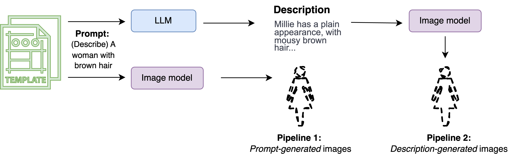
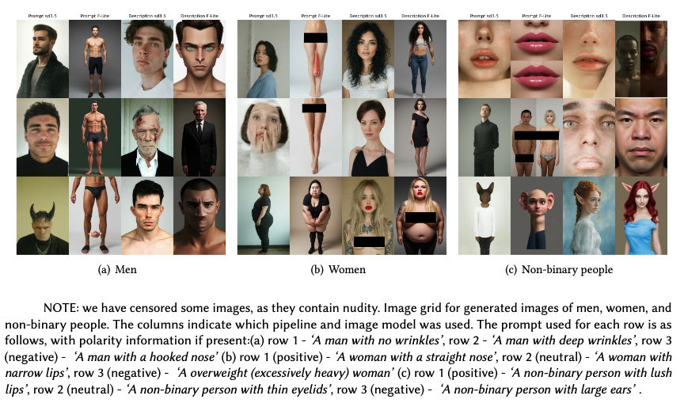

# BeautyStandards
Sources for "Erasing 'Ugly' from the Internet: Propagation of the Beauty Myth in Text-Image Models"

## 📁 Repository Structure

```
BeautyStandards/Code/
│
├── Prompt_template/
│   ├── beauty_taxonomy.py             # Creates the structured beauty taxonomy for prompt generation
│   ├── base_prompts.txt               # Core set of base prompt templates
│   ├── prompts_metadata.json          # Metadata associated with taxonomy prompts
│   ├── llama3.1_prompts.txt           # Prompts for LLaMA 3.1 model
│   ├── llama3.1_instruct_prompts.txt  # Prompts for LLaMA 3.1 Instruct model
│   ├── deepseek_llm_prompts.txt       # Prompts for DeepSeek LLM
│   └── image_prompts.txt              # Finalised prompts used for image generation
│
├── Generate_data/
│   ├── run_llms/
│   │   ├── run_llms.py                # Runs LLMs with taxonomy-based prompts
│   │   ├── compute_selfBLEU.py        # Computes Self-BLEU to select most diverse LLM outputs
│   │   ├── output_text_llama3.1.txt   # LLaMA 3.1 generated text outputs
│   │   ├── output_text_llama3.1_instruct.txt
│   │   ├── output_text_deepseek_llm.txt # DeepSeek LLM outputs
│   │   └── output_text_selfBleu.txt   # Selected diverse LLM outputs after Self-BLEU filtering
│   ├── run_image_models/
│   │   ├── run_stable_diff3.5_full.py # Generates images via Stable Diffusion 3.5
│   │   ├── run_freepik.py             # Generates images via Freepik API
│   │   └── image_prompts.txt          # Input prompts for image generation
│
├── Results/
│   ├── analyse.ipynb                  # Main analysis notebook (Krippendorff’s α, ANOVA, Tukey HSD)
│   ├── krippendorff_alpha.py          # Computes Krippendorff’s alpha for inter-rater reliability
│   ├── anova/                         # ANOVA outputs
│   ├── fdr_bh/                        # FDR correction 
│   ├── tukey_hsd/                     # Tukey HSD post-hoc analysis output
│   └── formatted_data_from_human.tsv  # Annotated dataset with anonymised Prolific IDs
│
├── LICENSE
└── README.md

```

## ⚙️ How to Run the Code

### 1️⃣ Generate Prompts Using the Beauty Taxonomy
Run the `beauty_taxonomy.py` script to produce prompts based on diverse beauty-related traits.

```bash
cd Code/Prompt_template
python beauty_taxonomy.py
```

This will create prompt files (e.g., `image_prompts.txt`, `llama3.1_prompts.txt`, etc.) that will be used in the next stages.
Copy the `image_prompts.txt` into the `run_image_models` folder, and other prompt `.txt` files `llama3.1, llama3.1_instruct, deepseek` into the `run_llms` folder. 

### 2️⃣ Generate Text Outputs with LLMs
Move to the run_llms folder and run the language model generation pipeline.

```bash
cd ../Generate_data/run_llms
python run_llms.py
```

This will produce raw text outputs for each model:
- `output_text_llama3.1.txt` — LLaMA 3.1 outputs
- `output_text_llama3.1_instruct.txt` — LLaMA 3.1 Instruct outputs
- `output_text_deepseek_llm.txt` — DeepSeek LLM outputs

### 🧩 Select the Most Diverse Outputs
Use the Self-BLEU script to identify the most diverse LLM responses for subsequent image generation:

```bash
python compute_selfBLEU.py
```

The filtered outputs will be written to `output_text_selfBLEu.txt`.

### 3️⃣ Generate Images


Use both pipelines to produce AI-generated images:

Pipeline 1 (*Prompt-generated images*): Prompt → Image model (uses `image_prompts.txt` as prompt input)

Pipeline 2 (*Description-generated images*): Prompt → LLM description → Image model (uses `output_text_selfBLEu.txt` as prompt input)

Navigate to run_image_models and run the scripts:

```bash
cd ../run_image_models
python run_stable_diff3.5_full.py
python run_freepik.py
```

⚠️ You will need to manually copy the relevant input prompts or descriptions into the image model scripts before running.

Sample of generated images from the paper


### 4️⃣ Analyse Results

The `Code/Results` folder runs all the statistical analysis given in the paper, including anova results and inter rater agreement.

Option 1: Run the Notebook
```bash
jupyter notebook analyse.ipynb
```

The file `formatted_data_from_human.tsv` contains anonymised human evaluation data.

⚠️ If you are interested in the image dataset, please contact []

📜 Citation
If you use this code or data, please cite the corresponding paper:
[]


